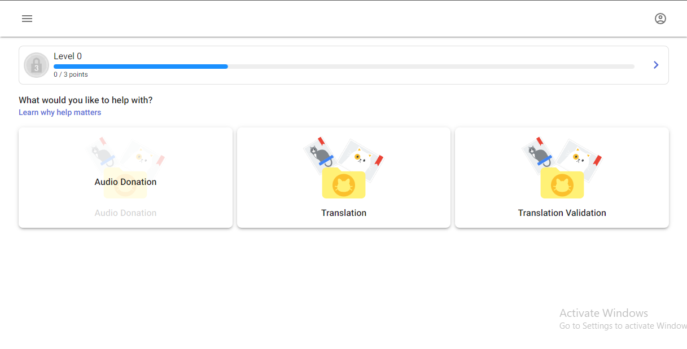

# Crowdsource by NSK.AI

## Web3 app for contributing to AI models

### Table of Content

- [Description](#description)
- [Illustration](#illustration)
- [Technologies](#technologies)
- [Launch](#launch)
- [Features](#features)
- [Contributing](#contributing)
- [Project Status](#project-status)
- [Source](#source)
- [License](#license)

### **Description**

This is a web app that allows users to contribute valuable data to AI models in a crowd source way. Like traditional crowd sourcing apps, users gain points as they contributions of which the value depends on the type of contribution. As they earn points they advance in levels and earn badges.

The app is built to be very similar to google crowdsource, but the key difference with Crowdsource by [NSK.AI](http://NSK.AI) is that it is a [Dapp](http://dapp.ai). The points users earn are directly stored on the blockchain and are equivalent to the Crowdsource Token. Badges are also not just mere jpegs, but NFTs.

Traditional AI crowdsourcing apps and sites do not reward users with cashable value. So the aim of this Project is to provide a platform where underrepresented datasets in the AI space can be sourced and fed to ML models, while rewarding users properly. 

### Illustrations

### **Technologies**

| Frontend | Blockend | Backend & DB |
| --- | --- | --- |
| Typescript | Solidity | Node.js |
| Next.js | Hardhat |  |
| Material UI | Alchemy |  |
| Ethers | Ethers |  |

### Launch

Project Link: [crowdsource-nsk.netlify.app](https://crowdsource-nsk.netlify.app) 

### Features

- Different Contribution Types
- Leaderboard based on contribution type
- User contributions overview
- User Achievements stats and badges
- Crypto Token earned from points

### ****Usage****

1. Go to [crowdsource-nsk.netlify.app](http://crowdsource-nsk.netlify.app) 
2. Pick a task
3. Read the instructions
4. Answer the questions (you can ‘skip’ or ‘back’)
5. Connect you Metamask wallet

### **Roadmap**

Project is divided into the following phases accordingly:

1. Frontend Build
2. Smart Contract Writing and Audit
3. Backend and Database Setup
4. NFTs Integration
5. Deployment

### **Contributing**

We are open to contributions, Here'e how:
- Fork this repository;
- Create a branch with your feature: `git checkout -b my-feature`;
- Commit your changes: `git commit -m "feat: my new feature"`;
- Push to your branch: `git push origin my-feature`.

Once your pull request has been merged, you can delete your branch.

### **Project status**

Phase: Frontend Build and Design

Status: In development phase 3

### **Source**

This app is inspired by [Crowdsource by Google](https://crowdsource.goolgle.com) especially in it’s design.

Huge Thanks to Contributors

| Name | Github | Role |
| --- | --- | --- |
| Precious Nwaoha | https://github.com/preciousnwaoha  | Design, Frontend Dev, Smart Contract |
|  |  |  |

### **License**

MIT
